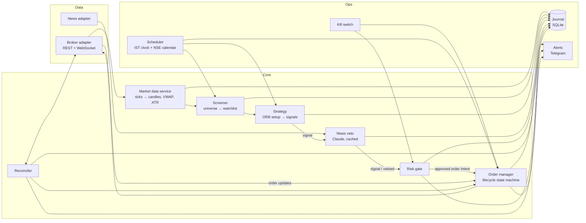
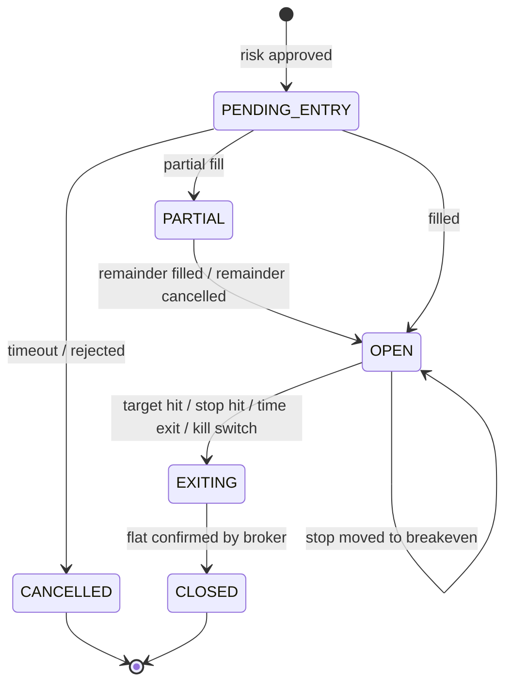

# Intraday Trading Agent — Architecture & Plan (v2)

> Status: design draft · Market: NSE cash equities (MIS intraday) · Timezone: IST everywhere
>
> v2 changes vs v1: an explicit strategy spec, a sentiment **veto** instead of a weighted blend,
> a realistic screening timeline, crash-safety (reconciliation, idempotency, broker-side stops),
> risk-based sizing, forward-only evaluation of the news layer, and phase exit criteria.
>
> v2.1: broker chosen (FYERS); historical candle store specified (§4.2b) from a probe of the FYERS history API.

---

## 1. Scope of v1

| In scope | Out of scope (later) |
|---|---|
| NSE cash equities, intraday (MIS), long and short | F&O, positional/swing trades |
| One rule-based setup (Opening Range Breakout) | Multiple strategies, ML models |
| Price/volume screener on a liquid universe | Full-market tick scanning |
| Claude news scoring used **only as a veto** | Claude generating trades or sizing |
| Paper trading → small live capital | Multi-account, multi-broker |
| Watchlist fixed at 09:30 | Mid-session "in-play" rescan of top gainers/losers (**v1.1**, §4.4b) |

## 2. Design principles

1. **Nothing skips the risk gate.** Every order intent passes through risk, including exits generated by the strategy (exits may only *reduce* exposure).
2. **The broker is the source of truth** for positions, orders, and funds. Local state is a cache that is reconciled, never trusted blindly.
3. **Protection lives at the broker.** Stop-loss orders are exchange/broker-resident, so a bot crash never leaves a naked position.
4. **Deterministic core, advisory LLM.** Entries, exits, and sizing are pure rule-based code. Claude can only block a trade, never create one.
5. **One code path for backtest, paper, and live.** Only the broker adapter differs (`SimBroker` vs `LiveBroker`).
6. **Log every decision**, not just every trade — including rejected candidates and why.
7. **Fail closed.** On any uncertainty (stale data, API errors, reconcile mismatch) the system stops opening positions.

## 3. System architecture



Single process, `asyncio` event loop, Python 3.11+. Components talk through in-process queues/events; no
microservices needed at this scale.

## 4. Components

### 4.1 Broker adapter (`broker/`)
A thin interface so the broker can be swapped and simulated.

```python
class Broker(Protocol):
    async def connect(self) -> None
    async def subscribe(self, symbols: list[str]) -> None          # WebSocket ticks
    async def historical(self, symbol, interval, start, end) -> DataFrame
    async def place_order(self, req: OrderRequest) -> str          # returns broker order id
    async def modify_order(self, order_id, **changes) -> None
    async def cancel_order(self, order_id) -> None
    async def orders(self) -> list[Order]
    async def positions(self) -> list[Position]
    async def funds(self) -> Funds
```

- Implementations: `SimBroker` (backtest + paper), `LiveBroker` (FYERS API v3; login in `broker/fyers_auth.py`).
- **Rate limiter** (token bucket) inside the adapter, configured from the broker's published limits. All callers go through it.
- Every order carries a **client tag / correlation ID** generated by us → retries are idempotent (check for an existing order with that tag before re-sending).
- Session: broker tokens expire daily. Morning login is a manual step unless the broker explicitly permits automated login.

### 4.2 Market data service (`data/`)
- Consumes ticks, builds 1-min and 5-min candles, maintains session VWAP, ATR(14) on 5-min, and opening range.
- **Staleness monitor:** if a subscribed symbol has no tick for `stale_tick_seconds` during market hours, or the WebSocket disconnects, emit `DATA_STALE` → risk gate blocks new entries until recovered.
- **Bad-tick filter:** reject ticks that jump more than `max_tick_jump_pct` from the last price without volume confirmation.
- After the close, the day's 1-min candles are appended to the historical candle store (§4.2b).

### 4.2b Historical candle store (`data/store.py`, `data/download.py`)
One store serves two consumers: the **backtester** reads years of 1-min candles, and the **live agent** reads
the last 20 trading days each morning for the baselines that can't come from live data (20-day turnover,
previous close, same-window RVOL, ATR warm-up, v1.1 volume profiles).

**Source: the FYERS history API** (probed 2026-09-23 with `scripts/probe_history.py`):

| Property | Finding | Consequence |
|---|---|---|
| Depth | 1-min and daily data back to at least Sep 2021 (5 years) | No paid vendor needed; backtest on 36 months (§9) |
| Range per request | 1-min: max 100 days (101 → `-50 Invalid input`) | Downloader requests ≤ 100-day chunks |
| Corporate actions | Prices are **split/bonus-adjusted**, retroactively (RELIANCE, BAJFINANCE, NESTLEIND, HDFCBANK showed no jump on their ex-dates) | See *adjustment* below |
| Volume | **Also adjusted.** Median volume 20 sessions after ÷ before the ex-date: 0.73× (RELIANCE, 2× event), 0.84× (BAJFINANCE, 10×), 1.05× (NESTLEIND, 2×), 1.21× (HDFCBANK, 2×) — within the no-event SBIN control range (0.64–1.10×), far from the factor. 1-min volume sums to daily volume (0.998–1.000) | 20-day volume baselines (RVOL, turnover) are safe across ex-dates |
| Latency | ~0.06 s median per call | Download time is set by the rate limit, not latency (see *Rate limit* below) |

**Layout** — the same 1-min candles in two layouts, so both access patterns read few files:

```
data/candles/
├── by_symbol/NSE_SBIN-EQ/1m_2026Q3.parquet   # one stock × one calendar quarter (as downloaded)
├── by_symbol/NSE_SBIN-EQ/1d_2026.parquet     # one stock × one calendar year of daily bars
├── 1m/2026-09-23.parquet                     # every stock for one day, sorted by symbol (built from by_symbol)
└── manifest.sqlite                           # downloaded chunks (complete?) + per stock-day quality results
```

| Question | Layout | Read (pilot, measured) |
|---|---|---|
| All stocks on one day — backtest replay, morning load | `1m/<day>.parquet` | 1 file, ~0.01 s (21 stocks) |
| One stock over 3 years — research | `by_symbol/<stock>/1m_*.parquet` | 13 files, 0.16 s |
| Whole store, day by day | `1m/*.parquet` | 742 files, 7.7 s (21 stocks) |

| Column | Type | Notes |
|---|---|---|
| `symbol` | string | FYERS format, e.g. `NSE:SBIN-EQ` (`:` becomes `_` in directory names) |
| `ts` | timestamp[ms], IST | Candle start minute |
| `open`, `high`, `low`, `close` | float64 | As returned by FYERS (adjusted) |
| `volume` | int64 | |

- **Size:** zstd-compressed Parquet (21% smaller than the default snappy, same read speed), row groups of 25,000
  rows so a one-symbol read skips most of a day file. Pilot: 185 MB for 21 symbols × 3 years (96 MB by_symbol +
  89 MB by-day) → **~4.5 GB for the Nifty 500 × 3 years**.
- **Why two layouts:** FYERS returns one stock at a time, so by_symbol is the natural download unit and makes a
  corporate-action refresh a one-stock re-download; the by-day files serve the backtest and live agent.
- **Chunks:** 1-min in calendar quarters (≤ 92 days, under the 100-day limit), daily in calendar years. A chunk
  whose period has ended is marked complete and never re-fetched; the chunk holding the latest session is
  re-fetched on every run. Today counts as final only after 15:45 IST.
- **Atomic writes:** write to a temp name, then rename; a crash never leaves a half-written file.
- **Rate limit:** ≤ 3 calls/s and ≤ 150 calls/min (FYERS publishes 10/s, 200/min); 3 retries with backoff per chunk.
  Full universe: ~500 × 17 chunks ≈ 8,500 calls ≈ 1 hour, once; afterwards one call per stock per run.
- **Not stored:** 5-min candles, VWAP, ATR — derived from 1-min on read, so there is one source of truth.
- **Adjustment:** because FYERS rescales old prices after a split or bonus, stored history for that symbol goes
  stale on the ex-date. On each corporate action (from the corporate-actions list in `config/universe/`), that
  symbol's by_symbol chunks are re-fetched and the by-day files rebuilt.
- **Daily bars:** the **official NSE close** differs slightly from the last 1-min close (it is a 30-minute
  average), and it is what the pre-open gap in Stage A is measured against.

**Cleaning** (at download): keep 09:15–15:29 only, drop duplicate timestamps. On some days FYERS also returns
09:08–09:14 bars — the 09:08 bar is the pre-open auction (equilibrium price, matched volume), 09:09–09:14 are flat
zero-volume fillers (seen on 2026-09-09: 382 bars). Being inconsistent, they are dropped; the gap in Stage A uses
the live pre-open quote, not history.

**Quality checks** (per stock-day, results in the manifest). `fail` stock-days are excluded by `read_day`
(and should alert in live); `warn` stays in the data, flagged:

| Check | Result |
|---|---|
| Missing / non-positive price, negative volume | fail |
| open/close outside high/low by > 0.5% of price | fail |
| open/close outside high/low by ≤ 0.5% | warn |
| Fewer bars than the index had that day (index short → special session, e.g. Muhurat) | warn |
| No bars on a day inside the stock's listed span | warn |
| Σ 1-min volume ÷ daily volume outside 0.90–1.01 | warn |

**Pilot result** (20 large caps + NIFTY50, 2023-09-23 → 2026-09-23, 742 days, 15,582 stock-days):
15,505 ok, 76 warn, 1 fail.
- 66 warn: open/close ≤ 0.2% outside high/low, almost all Nov 2023–Feb 2024 (a FYERS candle-building quirk
  of that period); at 09:15 the open is typically the auction price, missing from the bar's high/low.
- 9 warn: volume ratio 0.83–0.89 (likely block-deal-window trades, which are in the daily bar only) and
  BHARTIARTL 2026-09-18 at 1.28 (a +3% jump in the 15:28 bar on 5.3 M shares — unexplained; kept, flagged).
- Real events show up correctly: Muhurat session 2025-10-21 (61 bars, index also 61); ITC demerger
  special pre-open on 2025-01-06 (351 bars).
- 1 fail: HINDUNILVR 2025-12-05 (demerger day) — open 1.3% outside the bar's range, adjusted inconsistently.

### 4.3 News adapter (`news/`)
- Fetches headlines (text, timestamp, source, tickers) from an Indian-market news API. No scraping.
- Pre-market pull for the universe; incremental pulls only for watchlist symbols during the session.
- Deduplicates by headline hash.

### 4.4 Screener (`strategy/screener.py`)
Two stages, because most inputs don't exist before 09:15.

| Stage | Time | Filters |
|---|---|---|
| **A. Pre-open** | 08:45–09:10 | Universe = Nifty 500 (point-in-time list). Drop: ASM/GSM/T2T stocks, price < ₹50, 20-day avg turnover < `min_turnover_cr`, stocks with a price band ≤ 5%. Rank by pre-open gap % (09:08 equilibrium price vs prev close). |
| **B. Opening range** | 09:30 | Relative volume of first 15 min vs **same 15-min window** 20-day average ≥ `min_rvol`. ATR% within `[min_atr_pct, max_atr_pct]`. Relative strength vs Nifty over the first 15 min. Output: top `watchlist_size` symbols. |

Watchlist ranking: Stage B survivors are ranked by RVOL, ties broken by |RS|. A worked example of the
full decision path is in [stock-selection.md](stock-selection.md).

Note: Stage A's gap ranking is effectively the **pre-open top gainers/losers**, and Stage B's RS is the
top gainers/losers **net of the market move**. Stocks that only become gainers later are handled by §4.4b.

### 4.4b In-play rescan — top gainers/losers (`strategy/rescan.py`) · v1.1
Closes the blind spot of a watchlist frozen at 09:30: a stock flat at the open that gets news at 11:00
and moves 4% on 5× volume. **Disabled in v1** (`rescan.enabled: false`); built and backtested separately
in phase 7 so the ORB results stay clean.

**Scan** — every `rescan_interval_min` from `rescan_start` to `rescan_end`:
1. Batch-quote the Stage A–filtered universe (~350 symbols) through the broker quote API (a few calls per
   scan, inside the rate limiter). Gainers/losers are computed ourselves — no scraping NSE pages.
2. Take the top `rescan_top_n` gainers and top `rescan_top_n` losers by % change vs previous close.
3. Keep a stock only if **all** hold:

| Guard | Rule | Why |
|---|---|---|
| Participation | RVOL-to-time ≥ `rescan_min_rvol` (today's cumulative volume vs 20-day average cumulative volume at the same minute) | Real buying/selling, not a thin drift |
| Direction | RS vs Nifty has the same sign as the move | Moving with conviction, not with the index |
| Not stretched | abs(% change) ≤ `rescan_max_move_pct` | Most of a +8% move is already gone |
| Not extended | abs(price − VWAP) ≤ `rescan_max_vwap_atr` × ATR(5m) | Keeps the stop and R:R sensible |
| Circuit | Outside `circuit_buffer_pct` of the price band | Must be able to exit |
| Fresh | Not already on the watchlist, not traded today | — |

4. Add survivors to the watchlist (longs for gainers, shorts for losers) up to `max_watchlist_size`, ranked by
   RVOL-to-time. A rescan entry that hasn't triggered within `rescan_ttl_min` is removed.
5. Fetch and score headlines for new additions (news veto applies as usual).

The 20-day per-minute cumulative volume profile needed for RVOL-to-time is precomputed pre-market from
historical 1-min data.

**Setups** — the 09:15 opening range is stale by now, so rescan stocks use their own entries
(long shown; shorts mirror it):

| Setup | Trigger | Stop |
|---|---|---|
| VWAP pullback | Price pulls back to within `vwap_touch_pct` of VWAP, then a 5-min candle closes back above VWAP **and** above the previous candle's high | Pullback low, capped at `max_stop_atr` × ATR |
| Fresh consolidation breakout | Last 3 five-min candles span ≤ 1 × ATR; a 5-min candle closes above that range high with price > VWAP | Consolidation low, capped at `max_stop_atr` × ATR |

Target, breakeven, time rules, the 1-trade-per-symbol limit, and the whole risk gate are identical to §4.5 /
§4.7. Each `Signal` carries a `setup` field (`orb` | `vwap_pullback` | `consol_breakout`) so results are
reported per setup.

**Logged for later, not used yet:** sector clustering — when several in-play stocks share a sector
(e.g. three PSU banks), record it in `screen_results` as a candidate future ranking factor.

### 4.5 Strategy — ORB v1 (`strategy/orb.py`)
All numbers are starting hypotheses, set in config, to be validated by backtest.

| Rule | v1 definition |
|---|---|
| Opening range (OR) | High/low of 09:15–09:30 |
| Long entry | 5-min candle **closes** above OR high, price > VWAP, stock RS vs Nifty > 0 |
| Short entry | 5-min candle **closes** below OR low, price < VWAP, stock RS vs Nifty < 0 |
| Entry order | Limit at breakout candle close ± `entry_buffer_pct`; cancel if unfilled in `entry_timeout_s` |
| Stop | Opposite side of the breakout candle, capped at `1.5 × ATR(5m)`. Skip trade if stop distance < `min_stop_pct` (noise) |
| Target | `2R` |
| Management | At `+1R` move stop to breakeven |
| Time rules | No entries after 14:30. Force exit all positions at 15:10 |
| Frequency | Max 1 trade per symbol per day |

Output: a `Signal(symbol, side, entry, stop, target, reason, features)`.

### 4.6 News veto (`strategy/news_veto.py`)
- Runs **pre-market in batch** (and on new headlines for watchlist symbols), never in the order path. The strategy reads the cached verdict.
- Model: a small, cheap model (e.g. Haiku 4.5), structured output enforced via tool use / JSON schema:
  ```json
  {"signal": "bullish|bearish|neutral", "confidence": 0-100, "event_type": "earnings|order_win|regulatory|management|macro|other", "reasoning": "one sentence"}
  ```
- Input: headlines with timestamps + previous close, gap %, and sector — no future data.
- **Cache key:** hash of (model, prompt version, headlines). Same inputs → same stored output, so a day can be replayed exactly.
- **Veto rule:** block a long if `bearish & confidence ≥ veto_confidence`; block a short if `bullish & confidence ≥ veto_confidence`. Otherwise pass unchanged.
- Hard blocks regardless of sentiment: results due today, or a corporate action (e.g. ex-date, split) today.
- If the news API or Claude is down → pass-through (the veto is advisory) and log `NEWS_UNAVAILABLE`.

### 4.7 Risk gate (`risk/`)
Stateless checks against a `RiskState` snapshot. Returns `APPROVE(qty)` or `REJECT(reason)`.

**Sizing**
```
risk_amount = equity × risk_per_trade_pct
qty         = floor(risk_amount / |entry − stop|)
qty         = min(qty, floor(equity × max_position_pct × leverage / entry))
```

**Checks (all must pass for a new entry)**

| Check | Default |
|---|---|
| Kill switch not engaged | — |
| Market data healthy, reconcile OK | — |
| Within entry window (09:30–14:30) | — |
| Daily P&L (realized + unrealized) > −`max_daily_loss_pct` | 2% of equity |
| Consecutive losses < `max_consecutive_losses` | 3 |
| Trades today < `max_trades_per_day` | 5 |
| Open positions < `max_open_positions` | 3 |
| Positions in same sector < `max_per_sector` | 1 |
| Required margin ≤ available funds × `margin_buffer` | 0.8 |
| Not within `circuit_buffer_pct` of upper/lower circuit | 1% |
| Qty ≥ 1 after sizing | — |

On breach of daily loss or consecutive losses → **auto kill switch** for the rest of the day (exits still allowed).

### 4.8 Order manager (`execution/oms.py`)
Owns the lifecycle of each trade as a state machine:



- On fill (full or partial): **immediately** place a broker-resident SL order for the filled quantity. If the SL placement fails after retries → market-exit the position and alert.
- Target: a limit order at the broker, or watched locally. The OMS cancels the sibling when one side fills (Indian brokers generally lack intraday OCO). Handle the race where both fill → flatten the excess immediately.
- Use broker-native bracket/"super" orders where the chosen broker supports them — they simplify this but don't remove the need for reconciliation.
- 15:10 time exit: cancel all pending orders, market-exit all positions, confirm flat, alert if not flat by 15:14.

### 4.9 Reconciler (`execution/reconcile.py`)
- **On startup** and every `reconcile_interval_s`: fetch broker orders + positions, compare with OMS state.
- Unknown position at the broker → adopt it, attach a stop if none, alert.
- Local position not at the broker → mark closed, alert.
- Any mismatch → engage kill switch for new entries until resolved.

### 4.10 Journal (`journal/`) — SQLite
| Table | One row per |
|---|---|
| `screen_results` | symbol × stage per day: filters passed/failed and values |
| `news_scores` | Claude call: input hash, prompt version, model, raw output, latency, cost |
| `signals` | generated signal with features and reason |
| `risk_decisions` | signal: approved/rejected, reason, computed qty |
| `orders` | order event: tag, broker id, status, price, qty, timestamps |
| `trades` | completed trade: entry/exit, R multiple, P&L gross/net, costs, exit reason |
| `system_events` | kill switch, stale data, reconcile mismatch, errors |

### 4.11 Alerts (`ops/alerts.py`)
Telegram bot. Levels: `INFO` (fills, exits, daily summary), `WARN` (rejections, retries), `CRITICAL` (kill switch, unprotected position, reconcile mismatch, not flat by 15:14). The manual kill switch is also a Telegram command (`/kill`, `/status`, `/flatten`) plus a local file flag.

### 4.12 Scheduler (`ops/scheduler.py`)
IST clock, NSE holiday calendar, special sessions (e.g. Muhurat trading). Verifies system clock drift against NTP at startup and refuses to trade if drift > 2 s.

## 5. Daily timeline (IST)

Step-by-step detail, including what you do at each point, is in [daily-runbook.md](daily-runbook.md).

| Time | Action |
|---|---|
| 08:30 | Start process, clock check, broker login, reconcile (expect flat) |
| 08:45 | Load universe, apply exclusion lists, fetch headlines, run Claude news scoring (batch) |
| 09:08 | Read pre-open prices → gap ranking (Stage A) |
| 09:15 | Subscribe WebSocket for Stage A candidates, build candles |
| 09:30 | Opening range fixed → Stage B → watchlist |
| 09:30–14:30 | Strategy emits signals → veto → risk → OMS |
| 09:45–13:00 | *(v1.1)* In-play rescan every 15 min → add top gainers/losers that pass the guards |
| 14:30 | No new entries |
| 15:10 | Force exit all, cancel all orders |
| 15:14 | Confirm flat (CRITICAL alert if not) |
| 15:30+ | Final reconcile, compute day P&L with costs, write daily report, archive candles |

## 6. Failure modes

| Failure | Response |
|---|---|
| Bot crashes with open position | Broker-resident SL protects it; on restart the reconciler rebuilds state |
| Order request times out | Look up by client tag before retrying; never blind-resend |
| WebSocket drops / stale ticks | Block new entries; existing positions keep broker SLs; reconnect with backoff |
| Rate limit hit | Adapter queues; entries are dropped rather than delayed past `entry_timeout_s` |
| SL placement rejected | Retry ×2, then market exit + CRITICAL alert |
| Stock hits circuit | Can't exit — alert; the circuit buffer check makes this rare |
| Claude / news API down | Veto passes through, logged |
| Clock drift | Refuse to start |
| Daily loss breached | Auto kill switch for the day |

## 7. Project structure

```
stock-agent/
├── config/
│   ├── settings.yaml          # all parameters below
│   └── universe/              # point-in-time index constituents, exclusion lists
├── src/agent/
│   ├── broker/                # base.py, sim.py, fyers.py, fyers_auth.py
│   ├── data/                  # candles.py, indicators.py, staleness.py, store.py, download.py
│   ├── news/                  # client.py
│   ├── strategy/              # screener.py, orb.py, news_veto.py, rescan.py, setups.py (v1.1)
│   ├── risk/                  # gate.py, sizing.py, state.py
│   ├── execution/             # oms.py, reconcile.py
│   ├── journal/               # db.py, schema.sql
│   ├── ops/                   # scheduler.py, alerts.py, killswitch.py, calendar.py
│   ├── backtest/              # engine.py, costs.py, report.py
│   └── main.py                # modes: backtest | paper | live
├── tests/
├── scripts/                   # check_connection.py, probe_history.py
├── data/                      # candles/ (parquet + manifest), journal.db, fyers_token.json — gitignored
└── docs/
```

## 8. Configuration (`config/settings.yaml`)

```yaml
mode: paper                    # backtest | paper | live
capital: 100000
risk:
  risk_per_trade_pct: 0.5
  max_position_pct: 20
  leverage: 1                  # start without MIS leverage
  max_daily_loss_pct: 2.0
  max_consecutive_losses: 3
  max_trades_per_day: 5
  max_open_positions: 3
  max_per_sector: 1
  margin_buffer: 0.8
  circuit_buffer_pct: 1.0
screener:
  universe: nifty500
  min_price: 50
  min_turnover_cr: 20
  min_rvol: 2.0
  min_atr_pct: 1.0
  max_atr_pct: 5.0
  watchlist_size: 10
rescan:                        # v1.1 — §4.4b
  enabled: false
  rescan_start: "09:45"
  rescan_end: "13:00"
  rescan_interval_min: 15
  rescan_top_n: 10             # per side (gainers and losers)
  rescan_min_rvol: 2.0
  rescan_max_move_pct: 7.0
  rescan_max_vwap_atr: 2.0
  rescan_ttl_min: 60
  max_watchlist_size: 15
  vwap_touch_pct: 0.2
strategy:
  opening_range_min: 15
  entry_buffer_pct: 0.05
  entry_timeout_s: 60
  min_stop_pct: 0.3
  max_stop_atr: 1.5
  target_r: 2.0
  breakeven_at_r: 1.0
  last_entry: "14:30"
  force_exit: "15:10"
news:
  enabled: true
  veto_confidence: 70
  model: claude-haiku-4-5
  prompt_version: v1
ops:
  stale_tick_seconds: 20
  max_tick_jump_pct: 5
  reconcile_interval_s: 30
  max_clock_drift_s: 2
```

## 9. Evaluation methodology

**Backtest (price/volume only)**
- 1-min data, at least 12 months, covering trending and choppy periods. FYERS has ≥ 5 years (§4.2b), so the target is **36 months**.
- Point-in-time universe (include stocks that later left the index) to avoid survivorship bias.
- Signals use only completed candles; fills at next-bar open + slippage (`slippage_bps`, start at 5).
- Full cost model from the broker's charge sheet: brokerage, STT (sell side), exchange transaction charges, SEBI fee, stamp duty (buy side), GST.
- Walk-forward: tune on the first two-thirds, validate on the last third (months 1–24 / 25–36; with only 12 months, 1–8 / 9–12). No re-tuning on the validation set.
- Baseline: the same risk and exit rules with random entries on the same watchlist.

**News veto (forward only)**
Historical news backtests are unreliable (timestamp quality, and the model may already know outcomes of past events). Evaluate in paper trading: log every vetoed trade and simulate its outcome in shadow. The veto stays only if vetoed trades have clearly worse expectancy than the trades it allowed.

**Success criteria to go live** (net of costs)
- ≥ 100 trades in backtest validation, and ≥ 40 trades in paper
- Expectancy > 0.15R per trade, profit factor > 1.3
- Max drawdown < 8% of capital
- Beats the random-entry baseline
- Paper results within reasonable range of backtest (no large slippage surprise)
- Zero unprotected positions and zero unreconciled mismatches during paper

## 10. Compliance checklist (confirm with broker before live)
- [ ] API access enabled; static IP whitelisted if required
- [ ] 2FA / login flow that complies with broker terms (no prohibited login automation)
- [ ] Order rate stays below the exchange threshold that requires algo registration; confirm tagging requirements
- [ ] Journal retains all orders and decisions (audit trail)
- [ ] Understand broker's intraday auto square-off time and charges

## 11. Build phases

| Phase | Deliverable | Exit criteria |
|---|---|---|
| **0. Spec & data** | This doc finalized; ~~broker chosen~~ (FYERS); ~~data source chosen~~ (FYERS history, §4.2b); candle downloader + store; point-in-time Nifty 500 list with sectors | ~~Pilot (20 stocks + NIFTY50 × 36 months) passes quality checks~~ (done, §4.2b); then the full universe loadable |
| **1. Core + risk** | Config, journal, risk gate, sizing, kill switch, calendar | Unit tests cover every risk rule and edge case |
| **2. Backtester** | `SimBroker`, cost model, ORB strategy, screener, reports | Reproducible backtest report; passes or fails the success criteria. **Stop and rethink the strategy if it fails.** |
| **3. Broker + OMS** | `LiveBroker` adapter, OMS state machine, reconciler, alerts | Paper mode runs a full day unattended; kill-the-process test recovers correctly |
| **4. Paper trading** | 2–4 weeks live paper | Success criteria met on paper; no unprotected positions |
| **5. News veto** | News adapter, Claude scoring, cache, shadow evaluation | Veto shows measurable benefit, else leave disabled |
| **6. Live (small)** | Live mode, 10–25% of intended capital, leverage 1 | 4 weeks within expected drawdown before scaling |
| **7. In-play rescan (v1.1)** | `rescan.py`, VWAP-pullback and consolidation-breakout setups, RVOL-to-time profiles | Backtested **separately** from ORB, then paper-traded. Keep only if rescan trades alone meet the success criteria **and** ORB + rescan beats ORB alone net of costs. Can start after phase 2 in parallel with phases 3–4 |

## 12. Open decisions
- ~~Broker~~ — **decided: FYERS** (API v3; login, quotes and history verified 2026-09-23).
- ~~Historical 1-min data source~~ — **decided: FYERS history API** (≥ 5 years of adjusted 1-min data, §4.2b).
- News source for Indian equities (coverage, timestamp accuracy, cost).
- Hosting: home PC vs a VPS in Mumbai (static IP, uptime).
- Starting capital and the risk-per-trade that implies.
